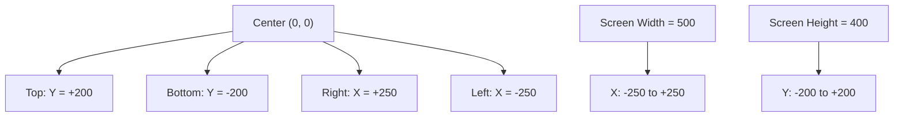
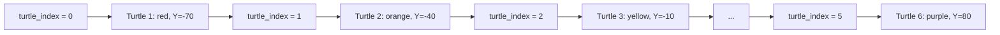

## Xây Dựng Turtle Racing Game

### Mục Tiêu Dự Án

Tạo trò chơi đua rùa với các tính năng:

- Popup cho phép người chơi đặt cược vào màu rùa
- Nhiều rùa (các màu cầu vồng) xếp hàng tại vạch xuất phát
- Các rùa di chuyển ngẫu nhiên về phía cạnh phải màn hình
- Rùa đầu tiên về đích sẽ được công bố là người chiến thắng
- Thông báo kết quả: người chơi thắng hoặc thua cược


### Thiết Lập Màn Hình

**Tạo screen với kích thước tùy chỉnh:**

```python
from turtle import Turtle, Screen

screen = Screen()
screen.setup(width=500, height=400)

screen.exitonclick()
```

**Lợi ích của keyword arguments:**

- Code dễ đọc và hiểu hơn
- Rõ ràng tham số nào là width, tham số nào là height
- Không bị nhầm lẫn về thứ tự tham số

```python
# Tốt - rõ ràng
screen.setup(width=500, height=400)

# Không tốt - khó hiểu
screen.setup(500, 400)  # Số nào là width? Số nào là height?
```


### Tạo Popup Đặt Cược

Sử dụng phương thức `textinput()` để hiển thị popup và nhận input từ người dùng:

```python
user_bet = screen.textinput(
    title="Make your bet", 
    prompt="Which turtle will win the race? Enter a color: "
)
print(user_bet)
```

**Các loại input:**

- `textinput()`: Nhận chuỗi văn bản từ người dùng
- `numinput()`: Nhận số từ người dùng


### Hệ Tọa Độ Turtle

Hiểu hệ tọa độ là chìa khóa để điều khiển vị trí turtle trên màn hình.

**Nguyên tắc cơ bản:**

- Tâm màn hình (center) có tọa độ **(0, 0)**
- Trục X: ngang (horizontal) - từ âm (trái) đến dương (phải)
- Trục Y: dọc (vertical) - từ âm (dưới) đến dương (trên)

**Tính toán tọa độ với kích thước màn hình:**

Với screen có `width=500` và `height=400`:

- **Trục X**: từ **-250** (trái) đến **+250** (phải) - tổng 500
- **Trục Y**: từ **-200** (dưới) đến **+200** (trên) - tổng 400



**Ví dụ tọa độ:**


| Vị trí | X | Y | Mô tả |
| :-- | :-- | :-- | :-- |
| Giữa màn hình | 0 | 0 | Điểm gốc |
| Giữa bên trái | -250 | 0 | Vạch xuất phát |
| Giữa bên phải | +250 | 0 | Đích đến |
| Giữa trên | 0 | +200 | Cạnh trên |
| Giữa dưới | 0 | -200 | Cạnh dưới |
| Ví dụ | 125 | 100 | Nửa bên phải, nửa bên trên |

### Di Chuyển Turtle Đến Vị Trí Xuất Phát

**Phương thức `goto(x, y)`:**

```python
tim = Turtle(shape="turtle")
tim.penup()  # Nhấc bút lên để không vẽ khi di chuyển
tim.goto(x=-230, y=-100)  # Di chuyển đến tọa độ cụ thể
```

**Giải thích:**

- `goto(x, y)`: Di chuyển turtle đến tọa độ chính xác
- `penup()`: Ngăn turtle vẽ đường khi di chuyển
- `shape="turtle"`: Tạo turtle với hình dạng turtle (thay vì mũi tên mặc định)

**Lưu ý quan trọng:**

- Nếu dùng `x=-250` (chính giữa cạnh trái), turtle sẽ nằm ngoài màn hình
- Nên dùng `x=-230` hoặc `-240` để turtle vẫn hiển thị trên màn hình
- Điều chỉnh X và Y để tìm vị trí phù hợp


### Tạo Nhiều Turtles Với Loop

**Danh sách màu sắc:**

```python
colors = ["red", "orange", "yellow", "green", "blue", "purple"]
```

**Cách 1: Tạo 6 turtles với vị trí Y cố định:**

```python
y_positions = [-70, -40, -10, 20, 50, 80]

for turtle_index in range(6):
    new_turtle = Turtle(shape="turtle")
    new_turtle.color(colors[turtle_index])
    new_turtle.penup()
    new_turtle.goto(x=-230, y=y_positions[turtle_index])
```

**Giải thích vị trí Y:**

- Bắt đầu từ `-70` (phía dưới)
- Tăng dần `30` pixels mỗi turtle
- Kết thúc ở `80` (phía trên)
- Tổng cộng 6 vị trí phân bố đều

**Cách hoạt động của loop:**




### Code Hoàn Chỉnh Phần Thiết Lập

```python
from turtle import Turtle, Screen

# Thiết lập màn hình
screen = Screen()
screen.setup(width=500, height=400)

# Popup đặt cược
user_bet = screen.textinput(
    title="Make your bet",
    prompt="Which turtle will win the race? Enter a color: "
)

# Danh sách màu và vị trí
colors = ["red", "orange", "yellow", "green", "blue", "purple"]
y_positions = [-70, -40, -10, 20, 50, 80]

# Tạo 6 turtles
for turtle_index in range(6):
    new_turtle = Turtle(shape="turtle")
    new_turtle.color(colors[turtle_index])
    new_turtle.penup()
    new_turtle.goto(x=-230, y=y_positions[turtle_index])

screen.exitonclick()
```


### Các Phương Thức Quan Trọng

**Screen methods:**

- `setup(width, height)`: Thiết lập kích thước màn hình
- `textinput(title, prompt)`: Hiển thị popup nhận text input
- `numinput(title, prompt)`: Hiển thị popup nhận number input

**Turtle methods:**

- `goto(x, y)`: Di chuyển đến tọa độ cụ thể
- `penup()`: Nhấc bút lên (không vẽ)
- `pendown()`: Đặt bút xuống (vẽ khi di chuyển)
- `color(color_name)`: Đặt màu cho turtle
- `shape(shape_name)`: Đặt hình dạng cho turtle


### Mẹo Thiết Kế Vị Trí

**Để phân bổ turtles đều:**

1. Xác định chiều cao khả dụng (ví dụ: từ -100 đến +100 = 200 pixels)
2. Chia đều cho số lượng turtles (200 / 6 ≈ 33 pixels mỗi turtle)
3. Điều chỉnh để có khoảng cách hợp lý (30 pixels trong ví dụ)

**Công thức tính toán tự động:**

```python
num_turtles = 6
spacing = 30
start_y = -(num_turtles - 1) * spacing / 2

y_positions = [start_y + i * spacing for i in range(num_turtles)]
# Kết quả: [-75, -45, -15, 15, 45, 75]
```


### Thử Nghiệm Tọa Độ

**Khuyến nghị:** Thử nghiệm với các giá trị X và Y khác nhau để hiểu rõ hệ tọa độ:

```python
# Thử nghiệm vị trí khác nhau
tim.goto(x=0, y=0)      # Giữa màn hình
tim.goto(x=100, y=100)  # Góc trên phải
tim.goto(x=-100, y=-100) # Góc dưới trái
tim.goto(x=250, y=0)    # Cạnh phải (đích đến)
```


### Ghi Chú Thêm

**Tại sao dùng `range(6)` thay vì `range(1, 7)`?**

- Python đánh index từ 0
- List colors có index từ 0 đến 5
- `range(6)` tạo ra  - khớp với index của list

**Tại sao dùng list riêng cho y_positions?**

- Dễ điều chỉnh vị trí từng turtle
- Linh hoạt hơn so với tính toán trong loop
- Code dễ đọc và dễ debug

**Liên kết:** [[Turtle Coordinate System]], [[Screen Setup]], [[Text Input]], [[Multiple Instances]], [[For Loop]], [[List Indexing]], [[goto() Method]], [[Turtle Racing Game]]

