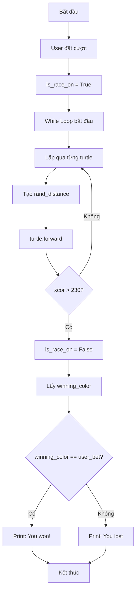

## Di Chuyển Ngẫu Nhiên \& Hoàn Thiện Turtle Racing Game

### Mục Tiêu

Làm cho các rùa di chuyển ngẫu nhiên về phía đích, xác định người chiến thắng, và thông báo kết quả cược cho người chơi.

### Tạo Chuyển Động Ngẫu Nhiên

Để tạo trải nghiệm game thú vị, mỗi bước di chuyển của rùa phải là một con số ngẫu nhiên. Điều này đảm bảo rùa không đi thẳng đến đích và game trở nên hấp dẫn hơn.

**Sử dụng random module:**

```python
import random

# Tạo khoảng cách ngẫu nhiên từ 0 đến 10
rand_distance = random.randint(0, 10)
```

**Lưu ý:** `randint()` là **inclusive** (bao gồm cả hai đầu), nghĩa là có thể trả về bất kỳ số nào từ 0 đến 10.

### Điều Khiển Game Với While Loop

**Tạo biến kiểm soát vòng lặp:**

```python
is_race_on = False

# Chỉ bắt đầu race khi user đã đặt cược
if user_bet:
    is_race_on = True
```

**Lợi ích:** Ngăn vòng lặp chạy trước khi người chơi hoàn tất việc đặt cược.

### Quản Lý Danh Sách Turtles

Thay vì tạo các turtle rời rạc, cần lưu trữ tất cả trong một list để dễ quản lý.

```python
# Tạo list rỗng để chứa turtles
all_turtles = []

colors = ["red", "orange", "yellow", "green", "blue", "purple"]
y_positions = [-70, -40, -10, 20, 50, 80]

# Tạo turtles và thêm vào list
for turtle_index in range(6):
    new_turtle = Turtle(shape="turtle")
    new_turtle.color(colors[turtle_index])
    new_turtle.penup()
    new_turtle.goto(x=-230, y=y_positions[turtle_index])
    all_turtles.append(new_turtle)  # Thêm vào list
```

**Lý do refactor tên biến:**

- Không còn gọi tất cả là `tim` vì có nhiều instances
- Dùng `new_turtle` rõ ràng hơn trong context của loop
- Mỗi turtle là một instance độc lập với state riêng


### Vòng Lặp Di Chuyển Turtles

```python
while is_race_on:
    for turtle in all_turtles:
        rand_distance = random.randint(0, 10)
        turtle.forward(rand_distance)
```

**Cách hoạt động:**

1. Lặp qua từng turtle trong list
2. Tạo khoảng cách ngẫu nhiên cho mỗi turtle
3. Di chuyển turtle đó với khoảng cách ngẫu nhiên
4. Tiếp tục cho đến khi có turtle về đích

### Điều Kiện Chiến Thắng

**Xác định khi nào turtle đạt đích:**

Turtle là đối tượng 40x40 pixels. Nếu chỉ kiểm tra X-coordinate = 250, turtle đã vượt quá đích.

**Tính toán:**

- Cạnh phải màn hình: X = 250
- Chiều rộng turtle: 40 pixels
- Nửa chiều rộng: 20 pixels
- Điểm kiểm tra: 250 - 20 = **230**

```python
while is_race_on:
    for turtle in all_turtles:
        rand_distance = random.randint(0, 10)
        turtle.forward(rand_distance)
        
        # Kiểm tra nếu turtle đã về đích
        if turtle.xcor() > 230:
            is_race_on = False  # Dừng game
            winning_color = turtle.pencolor()
            
            # Kiểm tra kết quả cược
            if winning_color == user_bet:
                print(f"You've won! The {winning_color} turtle is the winner!")
            else:
                print(f"You've lost. The {winning_color} turtle is the winner.")
```


### Xử Lý Màu Sắc Turtle

**Phương thức `color()`:**

Khi gọi `turtle.color()` mà không có tham số, nó trả về **tuple** gồm hai giá trị:

- Giá trị đầu: **pen color** (màu bút)
- Giá trị thứ hai: **fill color** (màu tô)

```python
# Kết quả khi print turtle.color()
('yellow', 'yellow')
```

**Giải pháp:** Sử dụng `pencolor()` để chỉ lấy màu bút (màu của turtle):

```python
winning_color = turtle.pencolor()  # Chỉ trả về 'yellow'
```


### Luồng Xử Lý Game




### Code Hoàn Chỉnh

```python
from turtle import Turtle, Screen
import random

screen = Screen()
screen.setup(width=500, height=400)

user_bet = screen.textinput(
    title="Make your bet",
    prompt="Which turtle will win the race? Enter a color: "
)

colors = ["red", "orange", "yellow", "green", "blue", "purple"]
y_positions = [-70, -40, -10, 20, 50, 80]
all_turtles = []

# Tạo turtles
for turtle_index in range(6):
    new_turtle = Turtle(shape="turtle")
    new_turtle.color(colors[turtle_index])
    new_turtle.penup()
    new_turtle.goto(x=-230, y=y_positions[turtle_index])
    all_turtles.append(new_turtle)

# Bắt đầu race
is_race_on = False

if user_bet:
    is_race_on = True

while is_race_on:
    for turtle in all_turtles:
        # Tạo chuyển động ngẫu nhiên
        rand_distance = random.randint(0, 10)
        turtle.forward(rand_distance)
        
        # Kiểm tra điều kiện chiến thắng
        if turtle.xcor() > 230:
            is_race_on = False
            winning_color = turtle.pencolor()
            
            if winning_color == user_bet:
                print(f"You've won! The {winning_color} turtle is the winner!")
            else:
                print(f"You've lost. The {winning_color} turtle is the winner.")

screen.exitonclick()
```


### Hiểu Về Coordinate System

**Các điểm quan trọng cần nhớ:**


| Vị trí | X-coordinate | Lý do |
| :-- | :-- | :-- |
| Cạnh phải màn hình | 250 | Giới hạn screen width |
| Điểm kiểm tra chiến thắng | 230 | 250 - (40/2) = 230 |
| Vạch xuất phát | -230 | -250 + (40/2) = -230 |

**Tại sao phải trừ/cộng 20?**

- Turtle có kích thước 40x40 pixels
- Tâm turtle là điểm tham chiếu cho tọa độ
- Cần tính từ tâm đến mép để xác định vị trí chính xác


### Multiple Instances \& State

**Khái niệm được thể hiện trong game:**

Mỗi turtle instance có:

- **State về vị trí**: Y-coordinate khác nhau tại vạch xuất phát
- **State về màu sắc**: Màu độc nhất để phân biệt
- **State về chuyển động**: Tốc độ ngẫu nhiên ở mỗi bước
- **State về hành động**: Di chuyển độc lập với các turtle khác

**Ví dụ cụ thể:**


| Turtle | Color | Start Y | Step 1 Distance | Step 2 Distance | Current X |
| :-- | :-- | :-- | :-- | :-- | :-- |
| Turtle 1 | red | -70 | 8 | 3 | -219 |
| Turtle 2 | orange | -40 | 2 | 9 | -219 |
| Turtle 3 | yellow | -10 | 10 | 7 | -213 |

Mỗi turtle hoạt động độc lập, có state riêng, không ảnh hưởng lẫn nhau.

### Sức Mạnh Của Object Oriented Programming

**Lợi ích đã thấy trong project:**

- **Tái sử dụng code**: Một class Turtle, nhiều instances
- **Quản lý dễ dàng**: Tất cả turtles trong một list
- **Độc lập**: Mỗi instance hoạt động riêng biệt
- **Linh hoạt**: Dễ thêm/bớt turtles hoặc thay đổi behavior
- **Mở rộng**: Có thể tạo hàng trăm turtles nếu cần

**Ứng dụng thực tế:**

- Game: Nhiều enemies, nhiều bullets
- Simulation: Nhiều particles, nhiều agents
- UI: Nhiều buttons, nhiều windows
- Business: Nhiều customers, nhiều orders


### Mẹo Debug \& Testing

**Khi gặp vấn đề với coordinate:**

- Print ra xcor() và ycor() của turtle
- Thay đổi giá trị từng chút và quan sát
- Vẽ đường hoặc đánh dấu để hiểu rõ hơn

**Khi game không dừng đúng:**

- Kiểm tra điều kiện `is_race_on`
- Đảm bảo `is_race_on = False` được gọi đúng chỗ
- Kiểm tra giá trị xcor() khi turtle về đích

**Khi nhiều turtles được công bố thắng:**

- Đảm bảo break khỏi loop ngay khi có winner
- Đặt `is_race_on = False` trước khi print kết quả


### Khuyến Nghị Thực Hành

**Để hiểu sâu hơn về coordinate system:**

- Thay đổi screen size và điều chỉnh lại tọa độ
- Thử các giá trị X, Y khác nhau
- Vẽ grid hoặc reference lines để dễ hình dung
- Tạo turtles ở các vị trí khác nhau và quan sát

**Để hiểu về multiple instances:**

- Thử tạo thêm nhiều turtles hơn
- Thay đổi state của từng instance riêng biệt
- Quan sát cách chúng hoạt động độc lập
- Thử làm cho một turtle di chuyển nhanh hơn các turtle khác


### Ghi Chú Thêm

Trong các projects phức tạp hơn sắp tới, sẽ thấy nhiều hơn nữa về:

- Multiple instances với different states
- Objects tương tác với nhau
- Complex behaviors và patterns
- Real-world applications của OOP

Đừng lo lắng nếu chưa hiểu 100% ngay lập tức. Qua việc xây dựng nhiều projects, các khái niệm này sẽ trở nên tự nhiên và dễ hiểu hơn.

**Liên kết:** [[While Loop]], [[Random Module]], [[List Management]], [[Coordinate System]], [[Multiple Instances]], [[Object State]], [[Game Logic]], [[Turtle Racing]], [[OOP Benefits]], [[xcor() Method]], [[pencolor() Method]]

