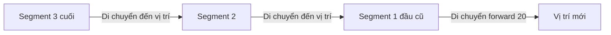

## Di Chuyển Rắn Tự Động - Bước 2

### Tổ chức segments với list

Thay vì tạo các segment riêng lẻ, cần tổ chức chúng vào một danh sách để quản lý:

```python
segments = []

for position in starting_positions:
    segment = Turtle("square")
    segment.color("white")
    segment.penup()
    segment.goto(position)
    segments.append(segment)
```

**Lưu ý:** Sử dụng `penup()` để tránh vẽ line khi turtle di chuyển.

### Tạo vòng lặp game chính

```python
game_is_on = True
while game_is_on:
    # Di chuyển các segments
```


### Vấn đề với animation mặc định

Khi di chuyển segments bằng cách đơn giản:

```python
for seg in segments:
    seg.forward(20)
```

**Vấn đề xảy ra:**

- Mỗi segment di chuyển độc lập như sâu bướm
- Animation hiển thị từng bước tạo và di chuyển turtle
- Các segment không di chuyển như một con rắn liền mạch


### Giải pháp: Tắt animation với tracer()

```python
screen.tracer(0)  # Tắt animation tự động
```

Sau đó sử dụng `screen.update()` để kiểm soát khi nào màn hình được vẽ lại:

```python
import time

screen.tracer(0)

while game_is_on:
    screen.update()  # Cập nhật màn hình sau khi di chuyển tất cả segments
    time.sleep(0.1)  # Delay 0.1 giây
    
    # Di chuyển segments
```

**Cơ chế hoạt động:**

- `tracer(0)` - Tắt animation tự động (giống monitors CRT vẽ từng dòng pixel)
- `update()` - Vẽ lại toàn bộ màn hình một lần (giống GIF animation)
- `sleep()` - Tạo độ trễ để kiểm soát tốc độ game


### Vấn đề khi segments không liên kết

Nếu chỉ di chuyển segment đầu theo hướng khác:

```python
segments[0].left(90)  # Quay đầu rắn
for seg in segments:
    seg.forward(20)
```

**Kết quả:** Đầu rắn đi một hướng, thân rắn đi hướng khác → Rắn bị tách rời!

### Giải pháp: Di chuyển segments theo chiến lược đặc biệt



**Thuật toán:**

1. Segment cuối cùng di chuyển đến vị trí segment thứ 2 từ cuối
2. Segment thứ 2 từ cuối di chuyển đến vị trí segment thứ 3 từ cuối
3. Cứ thế cho đến segment thứ 2
4. Cuối cùng, segment đầu tiên (head) di chuyển forward

### Code implementation

```python
import time
from turtle import Screen, Turtle

screen = Screen()
screen.setup(width=600, height=600)
screen.bgcolor("black")
screen.title("My Snake Game")
screen.tracer(0)

starting_positions = [(0, 0), (-20, 0), (-40, 0)]
segments = []

for position in starting_positions:
    segment = Turtle("square")
    segment.color("white")
    segment.penup()
    segment.goto(position)
    segments.append(segment)

game_is_on = True
while game_is_on:
    screen.update()
    time.sleep(0.1)
    
    # Di chuyển tất cả segments trừ head
    for seg_num in range(len(segments) - 1, 0, -1):
        new_x = segments[seg_num - 1].xcor()
        new_y = segments[seg_num - 1].ycor()
        segments[seg_num].goto(new_x, new_y)
    
    # Di chuyển head forward
    segments[0].forward(20)

screen.exitonclick()
```


### Giải thích range() trong Python

`range(start, stop, step)` tạo dãy số từ start đến stop với bước nhảy step:

```python
range(2, 0, -1)  # Tạo: 2, 1 (không bao gồm 0)
# start=2: Bắt đầu từ segment cuối (index 2)
# stop=0: Dừng tại segment đầu (không bao gồm 0)
# step=-1: Đi ngược từ cuối lên đầu
```

**Lưu ý:** `range()` không chấp nhận keyword arguments vì nó đến từ C language.

### Tại sao phải dùng len(segments) - 1?

- `len(segments)` = 3 (có 3 segments)
- Indices: 0, 1, 2
- Segment cuối: index = `len(segments) - 1` = 2
- Loop từ 2 → 1 (dừng tại 0, không bao gồm 0)


### Cơ chế di chuyển từng bước

```python
# Lần lặp 1: seg_num = 2 (segment cuối)
new_x = segments[1].xcor()  # Lấy tọa độ x của segment 1
new_y = segments[1].ycor()  # Lấy tọa độ y của segment 1
segments[2].goto(new_x, new_y)  # Segment 2 di chuyển đến vị trí segment 1

# Lần lặp 2: seg_num = 1 (segment giữa)
new_x = segments[0].xcor()  # Lấy tọa độ x của segment 0
new_y = segments[0].ycor()  # Lấy tọa độ y của segment 0
segments[1].goto(new_x, new_y)  # Segment 1 di chuyển đến vị trí segment 0

# Cuối cùng: Di chuyển head (segment 0) forward
segments[0].forward(20)
```


### Kiểm tra hoạt động

Để test rắn có di chuyển đúng không, thêm dòng này trước `segments[0].forward(20)`:

```python
segments[0].left(90)  # Rắn quay trái
```

Kết quả: Cả con rắn sẽ di chuyển theo hình tròn, thân rắn luôn theo đầu rắn.

### Kiến thức quan trọng

- **Animation control** - Sử dụng `tracer(0)` và `update()` để kiểm soát frame rate
- **Screen refresh** - Giống GIF animation, mỗi lần update là một frame mới
- **Movement strategy** - Di chuyển từ cuối lên đầu để các segment luôn liên kết
- **Range với negative step** - Tạo dãy số ngược để loop từ cuối lên đầu
- **Coordinate methods** - `xcor()` và `ycor()` lấy tọa độ hiện tại của turtle

**Liên kết:** [[Python List]], [[While Loop]], [[Range Function]], [[Turtle Animation]], [[Screen Tracer]], [[Time Module]], [[Coordinate System]], [[Game Loop]]

