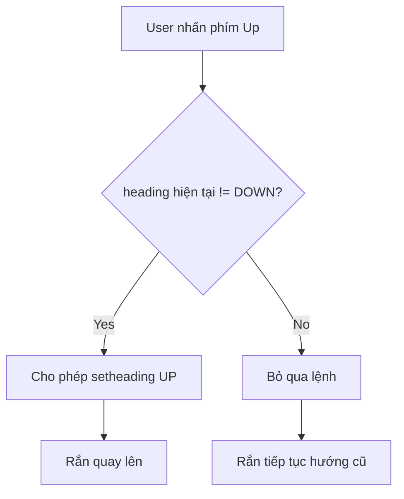

## Điều Khiển Rắn Bằng Bàn Phím - Bước 3
### Thiết lập lắng nghe phím bấm

Sử dụng các phím mũi tên để điều khiển rắn di chuyển:

```python
screen.listen()
screen.onkey(snake.up, "Up")
screen.onkey(snake.down, "Down")
screen.onkey(snake.left, "Left")
screen.onkey(snake.right, "Right")
```

**Các phím điều khiển:**

- `"Up"` - Phím mũi tên lên (viết hoa chữ cái đầu)
- `"Down"` - Phím mũi tên xuống
- `"Left"` - Phím mũi tên trái
- `"Right"` - Phím mũi tên phải


### Tạo thuộc tính head trong Snake Class

Thay vì truy cập `self.segments[0]` nhiều lần, tạo thuộc tính riêng cho đầu rắn:

```python
class Snake:
    
    def __init__(self):
        self.segments = []
        self.create_snake()
        self.head = self.segments[0]  # Đầu rắn
```

**Lưu ý:** Dòng này phải đặt **sau** `create_snake()` vì lúc đó `segments` mới có phần tử.

### Tạo constants cho các hướng di chuyển

```python
UP = 90
DOWN = 270
LEFT = 180
RIGHT = 0
```

**Hệ tọa độ heading (ngược chiều kim đồng hồ):**

- 0° - Hướng Đông (East, phải)
- 90° - Hướng Bắc (North, lên)
- 180° - Hướng Tây (West, trái)
- 270° - Hướng Nam (South, xuống)


### Cài đặt các phương thức điều khiển

#### Phiên bản cơ bản (chưa xử lý ràng buộc)

```python
class Snake:
    
    def up(self):
        self.head.setheading(UP)
    
    def down(self):
        self.head.setheading(DOWN)
    
    def left(self):
        self.head.setheading(LEFT)
    
    def right(self):
        self.head.setheading(RIGHT)
```

**Vấn đề:** Rắn có thể quay 180° ngược hướng đang di chuyển, điều này không hợp lệ trong game Snake.

### Xử lý logic không cho rắn đi ngược

Trong game Snake thật, rắn không thể đi ngược lại hướng đang di chuyển:

- Đang đi lên → không thể đi xuống
- Đang đi xuống → không thể đi lên
- Đang đi trái → không thể đi phải
- Đang đi phải → không thể đi trái


#### Code hoàn chỉnh với validation

```python
UP = 90
DOWN = 270
LEFT = 180
RIGHT = 0

class Snake:
    
    def __init__(self):
        self.segments = []
        self.create_snake()
        self.head = self.segments[0]
    
    def up(self):
        if self.head.heading() != DOWN:
            self.head.setheading(UP)
    
    def down(self):
        if self.head.heading() != UP:
            self.head.setheading(DOWN)
    
    def left(self):
        if self.head.heading() != RIGHT:
            self.head.setheading(LEFT)
    
    def right(self):
        if self.head.heading() != LEFT:
            self.head.setheading(RIGHT)
```


### Giải thích logic validation

**Method heading():**

- Trả về hướng hiện tại của turtle dưới dạng số (0-360)
- Là một **method** chứ không phải attribute: `self.head.heading()`

**Điều kiện kiểm tra:**

```python
if self.head.heading() != DOWN:
    self.head.setheading(UP)
```

- Kiểm tra: "Nếu đầu rắn KHÔNG đang hướng xuống"
- Thì mới cho phép: "Quay lên"
- Ngăn chặn: Rắn đi xuống rồi quay ngược lên ngay lập tức


### Sơ đồ luồng validation




### Code hoàn chỉnh main.py

```python
from turtle import Screen
from snake import Snake
import time

screen = Screen()
screen.setup(width=600, height=600)
screen.bgcolor("black")
screen.title("My Snake Game")
screen.tracer(0)

snake = Snake()

screen.listen()
screen.onkey(snake.up, "Up")
screen.onkey(snake.down, "Down")
screen.onkey(snake.left, "Left")
screen.onkey(snake.right, "Right")

game_is_on = True
while game_is_on:
    screen.update()
    time.sleep(0.1)
    snake.move()

screen.exitonclick()
```


### Code hoàn chỉnh snake.py

```python
from turtle import Turtle

STARTING_POSITIONS = [(0, 0), (-20, 0), (-40, 0)]
MOVE_DISTANCE = 20
UP = 90
DOWN = 270
LEFT = 180
RIGHT = 0

class Snake:
    
    def __init__(self):
        self.segments = []
        self.create_snake()
        self.head = self.segments[0]
    
    def create_snake(self):
        for position in STARTING_POSITIONS:
            segment = Turtle("square")
            segment.color("white")
            segment.penup()
            segment.goto(position)
            self.segments.append(segment)
    
    def move(self):
        for seg_num in range(len(self.segments) - 1, 0, -1):
            new_x = self.segments[seg_num - 1].xcor()
            new_y = self.segments[seg_num - 1].ycor()
            self.segments[seg_num].goto(new_x, new_y)
        self.head.forward(MOVE_DISTANCE)
    
    def up(self):
        if self.head.heading() != DOWN:
            self.head.setheading(UP)
    
    def down(self):
        if self.head.heading() != UP:
            self.head.setheading(DOWN)
    
    def left(self):
        if self.head.heading() != RIGHT:
            self.head.setheading(LEFT)
    
    def right(self):
        if self.head.heading() != LEFT:
            self.head.setheading(RIGHT)
```


### Kiểm tra và debug

**Cách test từng hướng:**

1. Tạo project đơn giản với một turtle
2. Thử các giá trị heading từ 0 đến 360
3. Quan sát hướng turtle quay để xác định đúng giá trị

**Test logic validation:**

- Chạy game, di chuyển rắn lên
- Thử nhấn phím xuống ngay lập tức
- Rắn không quay lại → validation hoạt động đúng


### Tổng kết những gì đã hoàn thành

#### Ngày 20 - Hoàn tất 3 bước đầu

1. ✅ Tạo thân rắn (3 segments màu trắng)
2. ✅ Di chuyển rắn tự động (thân theo đầu)
3. ✅ Điều khiển rắn bằng bàn phím (4 phím mũi tên)

#### Kỹ thuật đã áp dụng

- **Event listening** - Lắng nghe sự kiện bàn phím
- **Key binding** - Gắn phím với function
- **Heading system** - Hệ thống góc 360°
- **Validation logic** - Kiểm tra điều kiện trước khi thực thi
- **Constants** - Sử dụng hằng số cho các giá trị cố định
- **Screen tracer \& update** - Kiểm soát animation
- **Time delay** - Điều chỉnh tốc độ game


### Kiến thức quan trọng cần nhớ

**screen.listen():**

- Bắt đầu lắng nghe các sự kiện từ bàn phím
- Phải gọi trước `screen.onkey()`

**screen.onkey(function, key):**

- Gắn một function với một phím cụ thể
- Function truyền vào **không có dấu ngoặc đơn** `()`
- Ví dụ: `screen.onkey(snake.up, "Up")` chứ không phải `snake.up()`

**setheading(angle):**

- Đặt hướng của turtle theo góc độ
- Không làm turtle di chuyển, chỉ quay hướng

**heading():**

- Method trả về hướng hiện tại (0-360)
- Cần dấu ngoặc đơn: `self.head.heading()`


### Những khái niệm đã học

- **Event-driven programming** - Lập trình hướng sự kiện
- **User input handling** - Xử lý input từ người dùng
- **Game rules validation** - Kiểm tra quy tắc game
- **Direction constants** - Hằng số hướng di chuyển
- **Animation control** - Kiểm soát hoạt ảnh


### Chuẩn bị cho Ngày 21

Các tính năng còn lại cần hoàn thành:

1. Tạo thức ăn và phát hiện va chạm
2. Tạo bảng điểm
3. Phát hiện va chạm với tường
4. Phát hiện va chạm với thân rắn

Kiến thức mới sẽ học:

- **Inheritance (kế thừa)** - Tạo class con từ class cha
- **Slicing** - Cắt list trong Python

**Liên kết:** [[Event Handling]], [[Keyboard Input]], [[Screen Listen]], [[Key Binding]], [[Turtle Heading]], [[Setheading Method]], [[Conditional Logic]], [[Game Rules]], [[Direction Constants]], [[Input Validation]]

