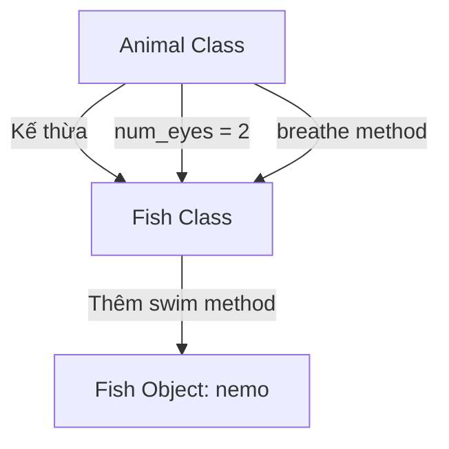

## Class Inheritance - Kế Thừa Class

### Khái niệm cơ bản

**Class Inheritance (Kế thừa class)** là tính năng cho phép một class mới kế thừa toàn bộ thuộc tính và phương thức từ một class đã tồn tại, sau đó có thể mở rộng thêm chức năng riêng.

### Ví dụ minh họa

Giả sử bạn tạo class `RobotChef` với các chức năng:

- `bake()` - Nướng
- `stir()` - Khuấy
- `measure()` - Đong đo

Sau đó bạn cần tạo `PastryChef` (Đầu bếp bánh ngọt). Thay vì viết lại toàn bộ, bạn có thể:

- Kế thừa tất cả methods từ `Chef`
- Thêm methods mới như `knead_dough()`, `whisk_eggs()`


### Inheritance bao gồm

**Attributes (Thuộc tính):**

- Các đặc điểm, tính chất của đối tượng
- Ví dụ: Kế thừa màu mắt, hình dáng mũi

**Methods (Phương thức):**

- Các hành vi, chức năng
- Ví dụ: Cách thái rau, cách nấu ăn


### Cú pháp Class Inheritance

```python
class Fish(Animal):
    def __init__(self):
        super().__init__()
```

**Các thành phần:**

- `class Fish(Animal)` - Fish kế thừa từ Animal
- `Animal` trong ngoặc đơn là **superclass (class cha)**
- `Fish` là **subclass (class con)**
- `super().__init__()` - Gọi initializer của class cha


### Ví dụ thực tế: Animal và Fish

#### Tạo superclass Animal

```python
class Animal:
    def __init__(self):
        self.num_eyes = 2
    
    def breathe(self):
        print("Inhale, exhale.")
```

**Class Animal có:**

- Attribute: `num_eyes = 2`
- Method: `breathe()`


#### Tạo subclass Fish (chưa kế thừa)

```python
class Fish:
    def swim(self):
        print("Moving in water.")

nemo = Fish()
nemo.swim()  # Output: Moving in water.
```

Fish hiện tại chỉ có method `swim()`, không có `breathe()` hoặc `num_eyes`.

#### Tạo Fish với Inheritance

```python
class Fish(Animal):
    def __init__(self):
        super().__init__()
    
    def swim(self):
        print("Moving in water.")

nemo = Fish()
nemo.swim()           # Output: Moving in water.
nemo.breathe()        # Output: Inhale, exhale.
print(nemo.num_eyes)  # Output: 2
```

**Giải thích:**

- `Fish(Animal)` - Fish kế thừa từ Animal
- `super().__init__()` - Khởi tạo tất cả attributes của Animal
- `nemo.breathe()` - Có thể gọi method từ Animal
- `nemo.num_eyes` - Có thể truy cập attribute từ Animal


### Sơ đồ quan hệ kế thừa




### Modify inherited methods

Đôi khi bạn muốn giữ chức năng cũ nhưng **thêm chức năng mới**:

```python
class Fish(Animal):
    def __init__(self):
        super().__init__()
    
    def breathe(self):
        super().breathe()
        print("doing this underwater.")
    
    def swim(self):
        print("Moving in water.")

nemo = Fish()
nemo.breathe()
```

**Output:**

```
Inhale, exhale.
doing this underwater.
```

**Cơ chế hoạt động:**

1. `super().breathe()` - Gọi method `breathe()` từ Animal
2. In ra: "Inhale, exhale."
3. Thêm dòng: "doing this underwater."
4. Kết quả: Method mở rộng với chức năng đặc biệt

### Tại sao cần Inheritance?

**Ưu điểm:**

- Tránh duplicate code (code trùng lặp)
- Dễ bảo trì và update
- Tái sử dụng code hiệu quả
- Tạo cấu trúc phân cấp logic

**Không dùng Inheritance:**

```python
class Fish:
    def __init__(self):
        self.num_eyes = 2  # Phải viết lại
    
    def breathe(self):
        print("Inhale, exhale.")  # Phải viết lại
    
    def swim(self):
        print("Moving in water.")
```

**Dùng Inheritance:**

```python
class Fish(Animal):
    def __init__(self):
        super().__init__()  # Tự động có num_eyes và breathe()
    
    def swim(self):
        print("Moving in water.")
```


### Thuật ngữ quan trọng

- **Superclass / Parent Class** - Class cha, class được kế thừa
- **Subclass / Child Class** - Class con, class kế thừa
- **super()** - Hàm truy cập đến superclass
- **Inheritance** - Kế thừa
- **Override** - Ghi đè method của class cha


### Ứng dụng trong Snake Game

Trong project Snake, chúng ta sẽ kế thừa từ **Turtle class**:

```python
class Food(Turtle):
    def __init__(self):
        super().__init__()
        # Thêm chức năng đặc biệt cho Food

class Scoreboard(Turtle):
    def __init__(self):
        super().__init__()
        # Thêm chức năng đặc biệt cho Scoreboard
```

**Lợi ích:**

- Food và Scoreboard tự động có tất cả methods của Turtle
- Không cần viết lại logic di chuyển, vẽ, hiển thị
- Chỉ cần thêm logic đặc thù cho mỗi class


### So sánh trước và sau Inheritance

**Không có Inheritance:**

```python
class Fish:
    def __init__(self):
        self.num_eyes = 2
        self.num_fins = 4
        self.has_tail = True
    
    def breathe(self):
        print("Inhale, exhale.")
    
    def eat(self):
        print("Eating food.")
    
    def swim(self):
        print("Moving in water.")
```

**Có Inheritance:**

```python
class Animal:
    def __init__(self):
        self.num_eyes = 2
    
    def breathe(self):
        print("Inhale, exhale.")
    
    def eat(self):
        print("Eating food.")

class Fish(Animal):
    def __init__(self):
        super().__init__()
        self.num_fins = 4
        self.has_tail = True
    
    def swim(self):
        print("Moving in water.")
```

→ Code Fish ngắn gọn, rõ ràng, dễ maintain.

### Lưu ý quan trọng

**Khi nào dùng super().__init__():**

- Luôn gọi trong `__init__()` của subclass
- Đảm bảo attributes của superclass được khởi tạo
- Đặt ở dòng đầu tiên trong `__init__()`

**Method Resolution Order:**

- Python tìm method theo thứ tự: Subclass → Superclass
- Nếu subclass có method cùng tên → dùng của subclass
- Nếu không → tìm trong superclass


### Ví dụ nâng cao: Multiple attributes

```python
class Animal:
    def __init__(self):
        self.num_eyes = 2
        self.is_alive = True
        self.can_move = True
    
    def breathe(self):
        print("Inhale, exhale.")

class Fish(Animal):
    def __init__(self):
        super().__init__()
        self.num_fins = 4
        self.lives_in = "water"
    
    def swim(self):
        print("Swimming...")

nemo = Fish()
print(f"Eyes: {nemo.num_eyes}")        # 2 (từ Animal)
print(f"Fins: {nemo.num_fins}")        # 4 (từ Fish)
print(f"Alive: {nemo.is_alive}")       # True (từ Animal)
print(f"Lives in: {nemo.lives_in}")    # water (từ Fish)
```


### Kiến thức mở rộng

**Multiple Inheritance:**
Python cho phép kế thừa từ nhiều class:

```python
class FlyingFish(Fish, Bird):
    pass
```

**Kiểm tra inheritance:**

```python
isinstance(nemo, Fish)    # True
isinstance(nemo, Animal)  # True
issubclass(Fish, Animal)  # True
```

**Liên kết:** [[Object Oriented Programming]], [[Superclass]], [[Subclass]], [[Method Override]], [[Code Reusability]], [[Turtle Class]], [[Class Hierarchy]], [[Python Inheritance]], [[Super Function]], [[Method Resolution Order]]

