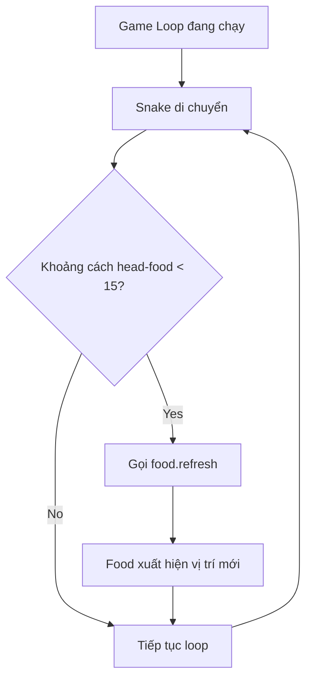

## Tạo Food Class và Phát Hiện Va Chạm - Bước 4

### Mục tiêu

Tạo class Food kế thừa từ Turtle để:

- Hiển thị thức ăn dạng hình tròn màu xanh
- Xuất hiện ở vị trí ngẫu nhiên
- Di chuyển đến vị trí mới khi rắn ăn được


### Tạo file food.py

#### Cấu trúc Food Class với Inheritance

```python
from turtle import Turtle
import random

class Food(Turtle):
    
    def __init__(self):
        super().__init__()
        self.shape("circle")
        self.penup()
        self.shapesize(stretch_len=0.5, stretch_wid=0.5)
        self.color("blue")
        self.speed("fastest")
        self.refresh()
    
    def refresh(self):
        random_x = random.randint(-280, 280)
        random_y = random.randint(-280, 280)
        self.goto(random_x, random_y)
```


### Giải thích chi tiết từng phần

#### Inheritance từ Turtle Class

```python
class Food(Turtle):
    def __init__(self):
        super().__init__()
```

**Tại sao kế thừa từ Turtle:**

- Food cần hiển thị trên màn hình → Turtle có sẵn chức năng render
- Cần di chuyển đến vị trí khác → Turtle có method `goto()`
- Cần đổi màu, hình dạng → Turtle có các methods tương ứng
- Không cần viết lại logic cơ bản, chỉ cần customize

**Lưu ý PyCharm warning:**
Khi thêm `class Food(Turtle)`, PyCharm sẽ cảnh báo: "Call to __init__ of super class is missed"

- Click vào bóng đèn để tự động thêm `super().__init__()`
- Hoặc tự gõ để thực hành


#### Cấu hình thuộc tính Food

**Shape - Hình dạng:**

```python
self.shape("circle")
```

Đổi từ hình mũi tên mặc định thành hình tròn.

**Penup - Không vẽ line:**

```python
self.penup()
```

Tránh vẽ đường khi food di chuyển.

**Shapesize - Kích thước:**

```python
self.shapesize(stretch_len=0.5, stretch_wid=0.5)
```

- Turtle mặc định: 20x20 pixels
- `stretch_len=0.5` - Giảm chiều dài xuống 50% → 10 pixels
- `stretch_wid=0.5` - Giảm chiều rộng xuống 50% → 10 pixels
- Kết quả: Food có kích thước 10x10 pixels

**Color - Màu sắc:**

```python
self.color("blue")
```

Đặt màu xanh dương (có thể tùy chỉnh theo ý thích).

**Speed - Tốc độ animation:**

```python
self.speed("fastest")
```

Tắt animation khi food di chuyển để không thấy quá trình từ tâm màn hình đến vị trí mới.

### Method refresh() - Di chuyển ngẫu nhiên

```python
def refresh(self):
    random_x = random.randint(-280, 280)
    random_y = random.randint(-280, 280)
    self.goto(random_x, random_y)
```

**Tính toán vùng spawn:**

- Màn hình: 600x600 pixels
- Trục X: từ -300 đến +300
- Trục Y: từ -300 đến +300
- Vùng an toàn: từ -280 đến +280 (tránh sát mép)

**Lý do tránh sát mép:**

- Khó điều khiển rắn đến sát tường
- Rắn dễ chết khi cố ăn food ở mép

**Cơ chế hoạt động:**

1. `random.randint()` tạo số nguyên ngẫu nhiên trong khoảng
2. `goto(x, y)` di chuyển food đến tọa độ mới
3. Method này được gọi khi khởi tạo và khi refresh

### Sử dụng Food trong main.py

```python
from snake import Snake
from food import Food

snake = Snake()
food = Food()
```

**Kết quả:**

- Food tự động xuất hiện ở vị trí ngẫu nhiên khi khởi tạo
- Xóa import `Turtle` trong main.py vì không dùng trực tiếp


### Phát hiện va chạm với Distance Method

#### Method distance() của Turtle

```python
turtle.distance(x, y)  # Khoảng cách đến tọa độ (x, y)
turtle.distance(other_turtle)  # Khoảng cách đến turtle khác
```

Trả về khoảng cách theo pixel giữa 2 điểm hoặc 2 turtles.

#### Implement collision detection

```python
# Trong game loop
if snake.head.distance(food) < 15:
    print("Nom nom nom")
    food.refresh()
```

**Logic:**

- `snake.head` - Segment đầu tiên của rắn
- `food` - Object Food (cũng là Turtle)
- `distance()` - Tính khoảng cách giữa head và food
- `< 15` - Nếu khoảng cách nhỏ hơn 15 pixels → Va chạm

**Tại sao chọn 15 pixels:**

- Food: 10x10 pixels
- Snake head: 20x20 pixels
- Buffer zone: 15 pixels cho cảm giác tự nhiên
- Có thể điều chỉnh xuống 10 để yêu cầu chính xác hơn


### Code hoàn chỉnh main.py

```python
from turtle import Screen
from snake import Snake
from food import Food
import time

screen = Screen()
screen.setup(width=600, height=600)
screen.bgcolor("black")
screen.title("My Snake Game")
screen.tracer(0)

snake = Snake()
food = Food()

screen.listen()
screen.onkey(snake.up, "Up")
screen.onkey(snake.down, "Down")
screen.onkey(snake.left, "Left")
screen.onkey(snake.right, "Right")

game_is_on = True
while game_is_on:
    screen.update()
    time.sleep(0.1)
    snake.move()
    
    # Detect collision with food
    if snake.head.distance(food) < 15:
        food.refresh()

screen.exitonclick()
```


### Sơ đồ luồng collision detection




### So sánh cách tạo Food

**Cách 1: Không dùng Inheritance (không tối ưu)**

```python
class Food:
    def __init__(self):
        self.food = Turtle()
        self.food.shape("circle")
        self.food.penup()
        # ... phải viết self.food. mọi lúc
```

**Cách 2: Dùng Inheritance (tối ưu)**

```python
class Food(Turtle):
    def __init__(self):
        super().__init__()
        self.shape("circle")
        self.penup()
        # ... viết trực tiếp self.
```

**Lợi ích:**

- Code ngắn gọn hơn
- Food **là một** Turtle, không **có một** Turtle
- Có thể truyền Food vào bất kỳ function nào nhận Turtle
- Dễ đọc và maintain


### Testing và điều chỉnh

**Test collision distance:**

```python
# Test với distance = 10 (chính xác)
if snake.head.distance(food) < 10:
    food.refresh()

# Test với distance = 20 (dễ hơn)
if snake.head.distance(food) < 20:
    food.refresh()
```

**Kết quả thực nghiệm:**

- Distance = 15 là giá trị cân bằng tốt nhất
- Không quá dễ, không quá khó
- Cảm giác va chạm tự nhiên


### Ghi chú quan trọng

**Về tăng chiều dài rắn:**
Hiện tại rắn chưa tăng chiều dài khi ăn food. Chức năng này sẽ được thêm ở Bước 7 khi implement tail collision detection.

**Về method reset():**

- `reset()` là method có sẵn từ Turtle class
- Không được đặt tên method mới là `reset()` → Sẽ override method gốc
- Dùng tên `refresh()` để tránh conflict

**Import random module:**
Cần import `random` để tạo tọa độ ngẫu nhiên:

```python
import random
```


### Methods kế thừa từ Turtle được sử dụng

- `shape()` - Đổi hình dạng
- `penup()` - Nhấc bút
- `shapesize()` - Thay đổi kích thước
- `color()` - Đổi màu
- `speed()` - Đặt tốc độ animation
- `goto()` - Di chuyển đến tọa độ
- `distance()` - Tính khoảng cách


### Kiểm tra kết quả

Chương trình hoạt động đúng khi:

- Food xuất hiện dạng hình tròn nhỏ màu xanh
- Vị trí food ngẫu nhiên mỗi lần chạy
- Khi rắn chạm food → Food di chuyển vị trí mới
- Không có lỗi trong console


### Thuật ngữ quan trọng

- **Inheritance** - Kế thừa, Food kế thừa từ Turtle
- **Superclass** - Turtle là superclass của Food
- **Method override** - Ghi đè method từ class cha
- **Collision detection** - Phát hiện va chạm
- **Distance calculation** - Tính toán khoảng cách
- **Random positioning** - Tạo vị trí ngẫu nhiên
- **Buffer zone** - Vùng đệm để tránh va chạm sát mép

**Liên kết:** [[Class Inheritance]], [[Turtle Class]], [[Random Module]], [[Distance Method]], [[Collision Detection]], [[Method Override]], [[Shapesize Method]], [[Object Positioning]], [[Game Mechanics]], [[Food Spawning]]

