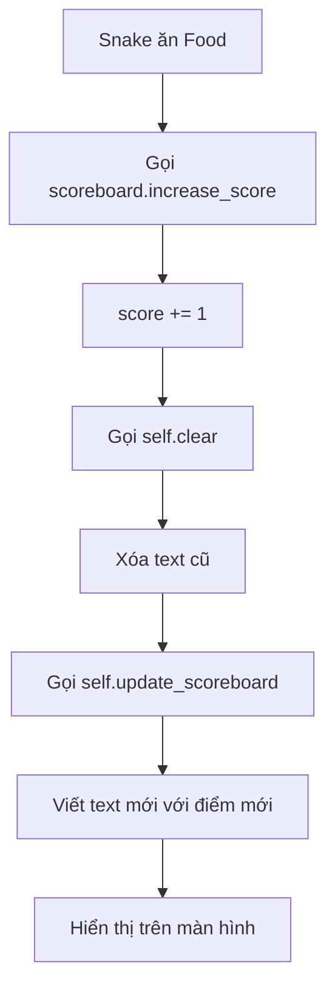

## Tạo Scoreboard - Bảng Điểm - Bước 5

### Mục tiêu

Tạo bảng điểm hiển thị trên màn hình để:

- Theo dõi số lượng food rắn đã ăn
- Tự động cập nhật mỗi khi ăn được food
- Hiển thị ở vị trí cố định trên màn hình


### Turtle.write() Method

Method `write()` cho phép turtle viết text lên màn hình:

```python
turtle.write(arg, move=False, align="left", font=("Arial", 8, "normal"))
```

**Tham số:**

- `arg` - Nội dung cần viết (string)
- `align` - Căn chỉnh: "left", "center", "right"
- `font` - Tuple gồm (font_name, font_size, font_type)
    - Font name: "Arial", "Courier", "Times New Roman"...
    - Font size: số nguyên (12, 24, 36...)
    - Font type: "normal", "bold", "italic", "underline"


### Tạo file scoreboard.py

#### Cấu trúc Scoreboard Class

```python
from turtle import Turtle

ALIGNMENT = "center"
FONT = ("Courier", 24, "normal")

class Scoreboard(Turtle):
    
    def __init__(self):
        super().__init__()
        self.score = 0
        self.color("white")
        self.penup()
        self.goto(0, 270)
        self.hideturtle()
        self.update_scoreboard()
    
    def update_scoreboard(self):
        self.write(f"Score: {self.score}", align=ALIGNMENT, font=FONT)
    
    def increase_score(self):
        self.score += 1
        self.clear()
        self.update_scoreboard()
```


### Giải thích chi tiết từng phần

#### Constants cho Font và Alignment

```python
ALIGNMENT = "center"
FONT = ("Courier", 24, "normal")
```

**Lợi ích sử dụng constants:**

- Dễ thay đổi style mà không cần sửa code logic
- Tất cả config tập trung ở đầu file
- Code dễ đọc và maintain hơn

**Lưu ý về Font tuple:**

- Phải là **tuple** (có dấu ngoặc đơn)
- Không phải list hay string đơn
- PyCharm sẽ warning nếu dùng sai format


#### Khởi tạo Scoreboard

```python
def __init__(self):
    super().__init__()
    self.score = 0
    self.color("white")
    self.penup()
    self.goto(0, 270)
    self.hideturtle()
    self.update_scoreboard()
```

**Thứ tự quan trọng của các dòng code:**

1. **super().__init__()** - Kế thừa từ Turtle class
2. **self.score = 0** - Khởi tạo điểm ban đầu
3. **self.color("white")** - Đặt màu trước khi viết (quan trọng!)
4. **self.penup()** - Nhấc bút trước khi di chuyển
5. **self.goto(0, 270)** - Di chuyển lên trên cùng
6. **self.hideturtle()** - Ẩn icon turtle
7. **self.update_scoreboard()** - Viết điểm lên màn hình

**Vấn đề thứ tự:**

```python
# SAI - Text sẽ vẫn màu đen
self.write(f"Score: {self.score}")
self.color("white")  # Quá muộn!

# ĐÚNG - Màu được áp dụng cho text
self.color("white")
self.write(f"Score: {self.score}")
```

**Vấn đề vẽ đường:**

```python
# SAI - Vẽ line từ (0,0) đến (0,270)
self.goto(0, 270)
self.penup()

# ĐÚNG - Không vẽ line
self.penup()
self.goto(0, 270)
```


#### Method update_scoreboard()

```python
def update_scoreboard(self):
    self.write(f"Score: {self.score}", align=ALIGNMENT, font=FONT)
```

**Chức năng:**

- Viết điểm số hiện tại lên màn hình
- Sử dụng f-string để insert giá trị động
- Áp dụng alignment và font từ constants

**F-string syntax:**

```python
f"Score: {self.score}"
# Nếu self.score = 5 → "Score: 5"
# Nếu self.score = 10 → "Score: 10"
```


#### Method increase_score()

```python
def increase_score(self):
    self.score += 1
    self.clear()
    self.update_scoreboard()
```

**Quy trình cập nhật điểm:**

1. Tăng điểm lên 1: `self.score += 1`
2. Xóa text cũ: `self.clear()`
3. Viết text mới: `self.update_scoreboard()`

**Vấn đề nếu không dùng clear():**

```
Score: 0
Score: 1
Score: 2
```

→ Các text chồng lên nhau, không đọc được!

**Với clear():**

```
Score: 2  (text cũ bị xóa trước khi viết mới)
```


### Sử dụng Scoreboard trong main.py

```python
from scoreboard import Scoreboard

scoreboard = Scoreboard()

# Trong game loop
if snake.head.distance(food) < 15:
    food.refresh()
    scoreboard.increase_score()
```

**Luồng hoạt động:**

1. Rắn chạm food
2. Food di chuyển vị trí mới
3. Scoreboard tăng điểm và cập nhật hiển thị

### Code hoàn chỉnh main.py

```python
from turtle import Screen
from snake import Snake
from food import Food
from scoreboard import Scoreboard
import time

screen = Screen()
screen.setup(width=600, height=600)
screen.bgcolor("black")
screen.title("My Snake Game")
screen.tracer(0)

snake = Snake()
food = Food()
scoreboard = Scoreboard()

screen.listen()
screen.onkey(snake.up, "Up")
screen.onkey(snake.down, "Down")
screen.onkey(snake.left, "Left")
screen.onkey(snake.right, "Right")

game_is_on = True
while game_is_on:
    screen.update()
    time.sleep(0.1)
    snake.move()
    
    # Detect collision with food
    if snake.head.distance(food) < 15:
        food.refresh()
        scoreboard.increase_score()

screen.exitonclick()
```


### Vị trí hiển thị Scoreboard

**Tính toán vị trí:**

- Màn hình: 600x600 pixels
- Trục Y: -300 (dưới) đến +300 (trên)
- Vị trí Y = 270: Gần sát trên cùng nhưng không chạm viền
- Vị trí X = 0: Ở giữa màn hình (center alignment)

```python
self.goto(0, 270)  # Center, gần top
```

**Điều chỉnh vị trí:**

```python
self.goto(0, 270)   # Top center
self.goto(-280, 270)  # Top left
self.goto(280, 270)   # Top right
```


### Tùy chỉnh Font

#### So sánh các font

**Arial - Font mặc định:**

```python
FONT = ("Arial", 24, "normal")
```

→ Hiện đại, dễ đọc, chuyên nghiệp

**Courier - Font video game:**

```python
FONT = ("Courier", 24, "normal")
```

→ Monospace, cảm giác retro game

**Times New Roman - Font cổ điển:**

```python
FONT = ("Times New Roman", 24, "normal")
```

→ Trang trọng, không phù hợp game

#### Font styles

```python
FONT = ("Courier", 24, "normal")   # Bình thường
FONT = ("Courier", 24, "bold")     # Đậm
FONT = ("Courier", 24, "italic")   # Nghiêng
```


#### Font sizes

```python
FONT = ("Courier", 12, "normal")  # Nhỏ
FONT = ("Courier", 24, "normal")  # Vừa
FONT = ("Courier", 36, "normal")  # Lớn
```


### Refactoring với update_scoreboard()

**Trước refactoring:**

```python
def __init__(self):
    # ... setup code ...
    self.write(f"Score: {self.score}", align=ALIGNMENT, font=FONT)

def increase_score(self):
    self.score += 1
    self.clear()
    self.write(f"Score: {self.score}", align=ALIGNMENT, font=FONT)
```

**Sau refactoring:**

```python
def __init__(self):
    # ... setup code ...
    self.update_scoreboard()

def update_scoreboard(self):
    self.write(f"Score: {self.score}", align=ALIGNMENT, font=FONT)

def increase_score(self):
    self.score += 1
    self.clear()
    self.update_scoreboard()
```

**Lợi ích:**

- Tránh duplicate code
- Dễ sửa đổi format text (chỉ sửa 1 chỗ)
- Code gọn gàng, dễ đọc


### Sơ đồ luồng cập nhật điểm




### Debugging thường gặp

**Vấn đề 1: Text màu đen, không thấy**

```python
# Giải pháp
self.color("white")  # Đặt trước write()
```

**Vấn đề 2: Text chồng lên nhau**

```python
# Giải pháp
self.clear()  # Xóa trước khi viết mới
```

**Vấn đề 3: Có line vẽ từ center lên top**

```python
# Giải pháp
self.penup()  # Gọi trước goto()
```

**Vấn đề 4: Font không đúng format**

```python
# SAI
FONT = "Arial", 24, "normal"  # Thiếu ngoặc đơn

# ĐÚNG
FONT = ("Arial", 24, "normal")  # Tuple
```

**Vấn đề 5: Turtle icon hiển thị**

```python
# Giải pháp
self.hideturtle()  # Ẩn icon
```


### Methods kế thừa từ Turtle được sử dụng

- `write()` - Viết text
- `clear()` - Xóa text đã viết
- `color()` - Đổi màu
- `penup()` - Nhấc bút
- `goto()` - Di chuyển đến vị trí
- `hideturtle()` - Ẩn turtle icon


### Best practices

**Tổ chức constants:**

```python
# Đặt ở đầu file, dễ tìm và sửa
ALIGNMENT = "center"
FONT = ("Courier", 24, "normal")
```

**Separation of concerns:**

```python
# update_scoreboard() - Chỉ việc hiển thị
# increase_score() - Xử lý logic tăng điểm
```

**DRY principle (Don't Repeat Yourself):**

- Không duplicate code write()
- Tạo method riêng cho việc hiển thị


### Mở rộng Scoreboard

**Thêm high score:**

```python
def __init__(self):
    super().__init__()
    self.score = 0
    self.high_score = 0
    # ...

def update_scoreboard(self):
    self.write(f"Score: {self.score} High Score: {self.high_score}", 
               align=ALIGNMENT, font=FONT)
```

**Game over message:**

```python
def game_over(self):
    self.goto(0, 0)
    self.write("GAME OVER", align="center", font=("Courier", 36, "bold"))
```


### Kiểm tra kết quả

Chương trình hoạt động đúng khi:

- Scoreboard hiển thị "Score: 0" ở trên cùng
- Không có turtle icon
- Text màu trắng trên nền đen
- Điểm tăng mỗi khi ăn food
- Text không chồng lên nhau


### Thuật ngữ quan trọng

- **turtle.write()** - Method viết text
- **tuple** - Cấu trúc dữ liệu cho font definition
- **clear()** - Xóa nội dung turtle đã vẽ/viết
- **f-string** - Formatted string literal
- **hideturtle()** - Ẩn turtle icon
- **Constants** - Hằng số viết HOA
- **Alignment** - Căn chỉnh text
- **Font tuple** - (tên, size, kiểu)

**Liên kết:** [[Class Inheritance]], [[Turtle Write Method]], [[F-String]], [[Turtle Clear]], [[Text Rendering]], [[Game UI]], [[Constants]], [[Font Formatting]], [[Scoreboard Class]], [[Score Tracking]]

