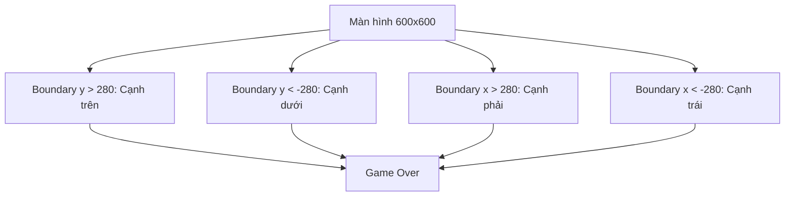
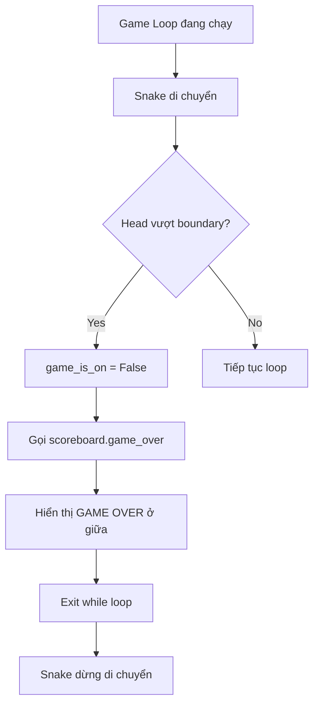

## Phát Hiện Va Chạm Với Tường - Bước 6

### Khái niệm Wall Collision

**Wall Collision Detection (Phát hiện va chạm với tường)** là việc xác định khi đầu rắn chạm vào bất kỳ cạnh nào của màn hình, kết thúc game.

### Xác định ranh giới màn hình

**Kích thước màn hình:**

- Màn hình: 600x600 pixels
- Trục X: từ -300 (trái) đến +300 (phải)
- Trục Y: từ -300 (dưới) đến +300 (trên)

**Vùng an toàn (boundary):**

- Để tránh rắn chết quá sớm, tạo vùng đệm
- Boundary: ±280 pixels thay vì ±300
- Rắn chết khi vượt qua boundary này

**Lý do chọn 280:**

- Head có kích thước 20x20 pixels
- Cần buffer zone để collision tự nhiên
- Giá trị 280 được xác định qua testing thực tế


### Logic phát hiện va chạm 4 cạnh

```python
# Detect collision with wall
if snake.head.xcor() > 280 or snake.head.xcor() < -280 or snake.head.ycor() > 280 or snake.head.ycor() < -280:
    game_is_on = False
    scoreboard.game_over()
```

**Điều kiện va chạm:**

- `xcor() > 280` - Vượt qua cạnh phải
- `xcor() < -280` - Vượt qua cạnh trái
- `ycor() > 280` - Vượt qua cạnh trên
- `ycor() < -280` - Vượt qua cạnh dưới

**Operator OR:**

- Chỉ cần 1 trong 4 điều kiện đúng → Game over
- Sử dụng `or` để kiểm tra tất cả các cạnh


### Sơ đồ ranh giới màn hình




### Thêm method game_over() vào Scoreboard

#### Cập nhật scoreboard.py

```python
from turtle import Turtle

ALIGNMENT = "center"
FONT = ("Courier", 24, "normal")

class Scoreboard(Turtle):
    
    def __init__(self):
        super().__init__()
        self.score = 0
        self.color("white")
        self.penup()
        self.goto(0, 270)
        self.hideturtle()
        self.update_scoreboard()
    
    def update_scoreboard(self):
        self.write(f"Score: {self.score}", align=ALIGNMENT, font=FONT)
    
    def game_over(self):
        self.goto(0, 0)
        self.write("GAME OVER", align=ALIGNMENT, font=FONT)
    
    def increase_score(self):
        self.score += 1
        self.clear()
        self.update_scoreboard()
```

**Giải thích method game_over():**

- `self.goto(0, 0)` - Di chuyển về giữa màn hình
- `self.write("GAME OVER")` - Viết text "GAME OVER"
- Không gọi `clear()` → Điểm số vẫn hiển thị ở trên
- Sử dụng cùng font và alignment với scoreboard


### Cập nhật game loop trong main.py

```python
from turtle import Screen
from snake import Snake
from food import Food
from scoreboard import Scoreboard
import time

screen = Screen()
screen.setup(width=600, height=600)
screen.bgcolor("black")
screen.title("My Snake Game")
screen.tracer(0)

snake = Snake()
food = Food()
scoreboard = Scoreboard()

screen.listen()
screen.onkey(snake.up, "Up")
screen.onkey(snake.down, "Down")
screen.onkey(snake.left, "Left")
screen.onkey(snake.right, "Right")

game_is_on = True
while game_is_on:
    screen.update()
    time.sleep(0.1)
    snake.move()
    
    # Detect collision with food
    if snake.head.distance(food) < 15:
        food.refresh()
        scoreboard.increase_score()
    
    # Detect collision with wall
    if snake.head.xcor() > 280 or snake.head.xcor() < -280 or snake.head.ycor() > 280 or snake.head.ycor() < -280:
        game_is_on = False
        scoreboard.game_over()

screen.exitonclick()
```


### Luồng xử lý khi va chạm tường




### Methods xcor() và ycor()

**xcor() - X Coordinate:**

```python
snake.head.xcor()  # Trả về tọa độ X hiện tại
# Ví dụ: 285, -290, 150...
```

**ycor() - Y Coordinate:**

```python
snake.head.ycor()  # Trả về tọa độ Y hiện tại
# Ví dụ: 270, -285, 0...
```

**Đây là methods, không phải attributes:**

- Cần dấu ngoặc đơn: `xcor()`, không phải `xcor`
- Trả về giá trị float
- Tính toán real-time position


### Tại sao không dùng 300 làm boundary?

```python
# Nếu dùng 300
if snake.head.xcor() > 300:  
    # Rắn đã ra khỏi màn hình hoàn toàn
    # Người chơi thấy rắn "biến mất" rồi mới game over
    # Trải nghiệm không tốt

# Dùng 280
if snake.head.xcor() > 280:
    # Rắn sắp chạm tường
    # Game over ngay khi head gần chạm viền
    # Cảm giác collision tự nhiên hơn
```


### Testing và fine-tuning

**Điều chỉnh boundary:**

```python
# Quá khó - Rắn chết sớm
if snake.head.xcor() > 260 or snake.head.xcor() < -260:

# Vừa phải - Recommended
if snake.head.xcor() > 280 or snake.head.xcor() < -280:

# Quá dễ - Rắn có thể ra ngoài một chút
if snake.head.xcor() > 290 or snake.head.xcor() < -290:
```

**Cách testing:**

- Chạy game nhiều lần
- Thử điều khiển rắn chạm các cạnh khác nhau
- Xem collision có tự nhiên không
- Điều chỉnh số 280 nếu cần


### Hiển thị kết quả game over

**Màn hình kết thúc:**

```
         Score: 2         (ở trên cùng)


       GAME OVER          (ở giữa màn hình)


    [Rắn dừng di chuyển]
```

**Tại sao không clear() score:**

- Người chơi cần thấy điểm cuối cùng
- Scoreboard ở trên, GAME OVER ở giữa
- Hai text không chồng lên nhau
- Thông tin đầy đủ cho người chơi


### Vòng lặp game và game_is_on

**Cơ chế hoạt động:**

```python
game_is_on = True  # Game bắt đầu

while game_is_on:  # Loop chạy khi True
    # Game logic
    
    if collision:
        game_is_on = False  # Đặt False
        # Loop kết thúc sau iteration này

# Code sau while loop (nếu có)
```

**Sequence khi collision:**

1. Phát hiện va chạm
2. `game_is_on = False`
3. Hiển thị "GAME OVER"
4. Hoàn thành iteration hiện tại
5. Kiểm tra điều kiện while → False
6. Exit loop
7. Snake dừng di chuyển

### So sánh các phương pháp kiểm tra

**Cách 1: OR chain (đang dùng)**

```python
if snake.head.xcor() > 280 or snake.head.xcor() < -280 or snake.head.ycor() > 280 or snake.head.ycor() < -280:
```

**Cách 2: Multiple if (không tối ưu)**

```python
if snake.head.xcor() > 280:
    game_is_on = False
if snake.head.xcor() < -280:
    game_is_on = False
# ... lặp lại 2 lần nữa
```

**Cách 3: Nested if (phức tạp không cần thiết)**

```python
if abs(snake.head.xcor()) > 280:
    game_is_on = False
if abs(snake.head.ycor()) > 280:
    game_is_on = False
```

→ Cách 1 là rõ ràng nhất, đọc dễ nhất

### Debugging thường gặp

**Vấn đề 1: Game không kết thúc**

```python
# Kiểm tra
print(snake.head.xcor(), snake.head.ycor())  # Debug position
# Xem giá trị có vượt 280 không
```

**Vấn đề 2: Game kết thúc quá sớm**

```python
# Boundary quá nhỏ
if snake.head.xcor() > 260:  # Tăng lên 280
```

**Vấn đề 3: GAME OVER không hiển thị**

```python
# Kiểm tra color
self.color("white")  # Trong scoreboard.__init__()
```

**Vấn đề 4: Rắn vẫn di chuyển sau game over**

```python
# Đảm bảo game_is_on = False
# Và không có code nào set lại True
```


### Tổng kết 6 bước đã hoàn thành

1. ✅ Tạo thân rắn
2. ✅ Di chuyển rắn tự động
3. ✅ Điều khiển rắn bằng bàn phím
4. ✅ Phát hiện va chạm với food
5. ✅ Tạo scoreboard
6. ✅ Phát hiện va chạm với tường

**Còn lại 1 bước cuối:**
7. ⏳ Phát hiện va chạm với thân rắn (tail collision)

### Kiến thức đã học

- **xcor() / ycor()** - Methods lấy tọa độ
- **Boundary checking** - Kiểm tra ranh giới
- **OR operator** - Toán tử logic OR
- **Game state** - Trạng thái game với boolean
- **While loop control** - Điều khiển vòng lặp
- **Testing methodology** - Phương pháp test và tinh chỉnh


### Kiểm tra kết quả

Chương trình hoạt động đúng khi:

- Rắn chạm cạnh trái → Game over
- Rắn chạm cạnh phải → Game over
- Rắn chạm cạnh trên → Game over
- Rắn chạm cạnh dưới → Game over
- "GAME OVER" hiển thị ở giữa màn hình
- Điểm số vẫn hiển thị ở trên
- Rắn dừng di chuyển hoàn toàn

**Liên kết:** [[Collision Detection]], [[Coordinate System]], [[Boolean Logic]], [[OR Operator]], [[Game State Management]], [[While Loop]], [[Boundary Checking]], [[Xcor Ycor Methods]], [[Game Over Screen]], [[Testing Games]]

