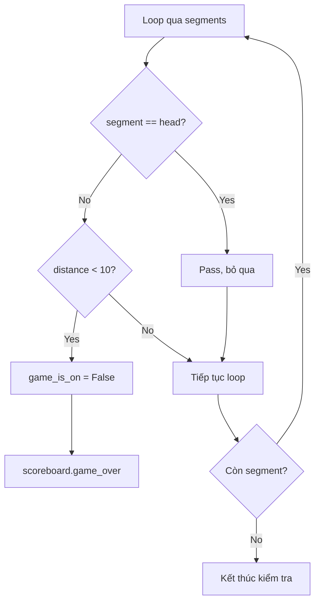

## Phát Hiện Va Chạm Với Thân Rắn - Bước 7 (Hoàn tất)

### Mục tiêu cuối cùng

Phát hiện khi đầu rắn chạm vào bất kỳ phần nào của thân để:

- Kết thúc game khi rắn tự cắn mình
- Tăng độ khó khi rắn càng dài
- Hoàn thiện toàn bộ game Snake


### Tăng chiều dài rắn khi ăn food

Trước khi phát hiện tail collision, cần làm rắn tăng chiều dài mỗi khi ăn food.

#### Thêm methods vào Snake Class

```python
class Snake:
    
    def add_segment(self, position):
        segment = Turtle("square")
        segment.color("white")
        segment.penup()
        segment.goto(position)
        self.segments.append(segment)
    
    def create_snake(self):
        for position in STARTING_POSITIONS:
            self.add_segment(position)
    
    def extend(self):
        self.add_segment(self.segments[-1].position())
```

**Refactoring create_snake():**

- Tách logic tạo segment thành method riêng `add_segment()`
- `create_snake()` gọi `add_segment()` cho mỗi vị trí
- Code gọn gàng, tái sử dụng được

**Method add_segment(position):**

- Tạo một segment mới
- Đặt segment tại vị trí được truyền vào
- Thêm segment vào list `self.segments`

**Method extend():**

- Gọi `add_segment()` với vị trí của segment cuối cùng
- Segment mới xuất hiện cùng vị trí với segment cuối
- Khi rắn di chuyển, segment mới sẽ "tách ra"


### List Indexing với số âm

```python
self.segments[-1]  # Lấy phần tử cuối cùng
```

**Cách hoạt động:**

```python
segments = [seg0, seg1, seg2, seg3, seg4]

segments[0]   # seg0 (đầu tiên)
segments[-1]  # seg4 (cuối cùng)
segments[-2]  # seg3 (thứ 2 từ cuối)
segments[-3]  # seg2 (thứ 3 từ cuối)
```

**Lợi ích:**

- Không cần biết độ dài list
- Luôn lấy được phần tử cuối
- Code linh hoạt khi list thay đổi kích thước


### Method position() của Turtle

```python
turtle.position()  # Trả về tuple (x, y)
```

**Ví dụ:**

```python
last_segment = self.segments[-1]
pos = last_segment.position()  # Ví dụ: (100.0, 50.0)
```

**Kết hợp với add_segment:**

```python
self.add_segment(self.segments[-1].position())
# Tạo segment mới tại vị trí của segment cuối
```


### Gọi extend() trong main.py

```python
# Detect collision with food
if snake.head.distance(food) < 15:
    food.refresh()
    scoreboard.increase_score()
    snake.extend()  # Thêm segment mới
```

**Kết quả:**

- Mỗi lần ăn food → Rắn dài thêm 1 segment
- Segment mới xuất hiện ở vị trí đuôi cũ
- Rắn liên tục tăng chiều dài


### Phát hiện Tail Collision

#### Logic cơ bản

```python
# Detect collision with tail
for segment in snake.segments:
    if snake.head.distance(segment) < 10:
        game_is_on = False
        scoreboard.game_over()
```

**Ý tưởng:**

- Loop qua tất cả segments trong rắn
- Kiểm tra khoảng cách từ head đến mỗi segment
- Nếu khoảng cách < 10 pixels → Va chạm


### Vấn đề: Head cũng nằm trong segments

**Bug xảy ra:**

- `snake.segments[0]` chính là `snake.head`
- Head so sánh với chính nó → Distance = 0
- Game over ngay lập tức!

**Minh họa:**

```python
for segment in snake.segments:  # [head, seg1, seg2, ...]
    # Iteration 1: segment = head
    if snake.head.distance(segment) < 10:  # 0 < 10 → True!
        game_is_on = False  # Game over ngay!
```


### Giải pháp: Bỏ qua Head

```python
# Detect collision with tail
for segment in snake.segments:
    if segment == snake.head:
        pass  # Bỏ qua head
    elif snake.head.distance(segment) < 10:
        game_is_on = False
        scoreboard.game_over()
```

**Cơ chế:**

1. Loop qua mỗi segment
2. Kiểm tra: segment này có phải head không?
3. Nếu là head → `pass` (bỏ qua)
4. Nếu không phải head → Kiểm tra distance
5. Distance < 10 → Game over

**Tại sao dùng elif:**

- `if` kiểm tra xem có phải head không
- `elif` chỉ chạy khi NOT head
- Logic rõ ràng, tránh lỗi


### Sơ đồ luồng Tail Collision Detection




### Code hoàn chỉnh snake.py

```python
from turtle import Turtle

STARTING_POSITIONS = [(0, 0), (-20, 0), (-40, 0)]
MOVE_DISTANCE = 20
UP = 90
DOWN = 270
LEFT = 180
RIGHT = 0

class Snake:
    
    def __init__(self):
        self.segments = []
        self.create_snake()
        self.head = self.segments[0]
    
    def create_snake(self):
        for position in STARTING_POSITIONS:
            self.add_segment(position)
    
    def add_segment(self, position):
        segment = Turtle("square")
        segment.color("white")
        segment.penup()
        segment.goto(position)
        self.segments.append(segment)
    
    def extend(self):
        self.add_segment(self.segments[-1].position())
    
    def move(self):
        for seg_num in range(len(self.segments) - 1, 0, -1):
            new_x = self.segments[seg_num - 1].xcor()
            new_y = self.segments[seg_num - 1].ycor()
            self.segments[seg_num].goto(new_x, new_y)
        self.head.forward(MOVE_DISTANCE)
    
    def up(self):
        if self.head.heading() != DOWN:
            self.head.setheading(UP)
    
    def down(self):
        if self.head.heading() != UP:
            self.head.setheading(DOWN)
    
    def left(self):
        if self.head.heading() != RIGHT:
            self.head.setheading(LEFT)
    
    def right(self):
        if self.head.heading() != LEFT:
            self.head.setheading(RIGHT)
```


### Code hoàn chỉnh main.py

```python
from turtle import Screen
from snake import Snake
from food import Food
from scoreboard import Scoreboard
import time

screen = Screen()
screen.setup(width=600, height=600)
screen.bgcolor("black")
screen.title("My Snake Game")
screen.tracer(0)

snake = Snake()
food = Food()
scoreboard = Scoreboard()

screen.listen()
screen.onkey(snake.up, "Up")
screen.onkey(snake.down, "Down")
screen.onkey(snake.left, "Left")
screen.onkey(snake.right, "Right")

game_is_on = True
while game_is_on:
    screen.update()
    time.sleep(0.1)
    snake.move()
    
    # Detect collision with food
    if snake.head.distance(food) < 15:
        food.refresh()
        scoreboard.increase_score()
        snake.extend()
    
    # Detect collision with wall
    if snake.head.xcor() > 280 or snake.head.xcor() < -280 or snake.head.ycor() > 280 or snake.head.ycor() < -280:
        game_is_on = False
        scoreboard.game_over()
    
    # Detect collision with tail
    for segment in snake.segments:
        if segment == snake.head:
            pass
        elif snake.head.distance(segment) < 10:
            game_is_on = False
            scoreboard.game_over()

screen.exitonclick()
```


### Tại sao chọn distance < 10?

**Kích thước segments:**

- Mỗi segment: 20x20 pixels
- Center đến center: Cần khoảng cách > 0 để collision

**Testing:**

- Distance = 10 cho cảm giác collision tự nhiên
- Distance = 5 quá khó (phải trúng chính xác)
- Distance = 15 quá dễ (collision từ xa)

**So sánh:**

```python
# Quá khó
if snake.head.distance(segment) < 5:

# Vừa phải - Recommended
if snake.head.distance(segment) < 10:

# Quá dễ
if snake.head.distance(segment) < 15:
```


### Cách viết ngắn gọn hơn (sẽ học ở bài sau)

Transcript mention về **slicing** - kỹ thuật sẽ cải thiện code:

```python
# Cách hiện tại (verbose)
for segment in snake.segments:
    if segment == snake.head:
        pass
    elif snake.head.distance(segment) < 10:
        game_is_on = False
        scoreboard.game_over()

# Cách dùng slicing (sẽ học)
for segment in snake.segments[1:]:  # Bỏ qua segment đầu (head)
    if snake.head.distance(segment) < 10:
        game_is_on = False
        scoreboard.game_over()
```


### Testing Snake Game hoàn chỉnh

**Các tình huống cần test:**

1. **Ăn food:**
    - Rắn tăng chiều dài ✓
    - Điểm số tăng ✓
    - Food xuất hiện vị trí mới ✓
2. **Va chạm tường:**
    - Cạnh trái → Game over ✓
    - Cạnh phải → Game over ✓
    - Cạnh trên → Game over ✓
    - Cạnh dưới → Game over ✓
3. **Va chạm thân:**
    - Rắn ngắn (3 segments) → Không thể tự cắn ✓
    - Rắn dài → Có thể tự cắn → Game over ✓
4. **Điều khiển:**
    - Phím mũi tên hoạt động tốt ✓
    - Không thể quay 180° ngược ✓

### Tổng kết 7 bước đã hoàn thành

1. ✅ Tạo thân rắn (3 segments)
2. ✅ Di chuyển rắn tự động
3. ✅ Điều khiển bằng bàn phím
4. ✅ Phát hiện va chạm với food
5. ✅ Tạo scoreboard
6. ✅ Phát hiện va chạm với tường
7. ✅ Phát hiện va chạm với thân rắn

🎉 **GAME SNAKE HOÀN CHỈNH!**

### Cấu trúc project cuối cùng

```
snake_game/
├── main.py           # Game loop và logic chính
├── snake.py          # Snake class
├── food.py           # Food class
└── scoreboard.py     # Scoreboard class
```

**Nguyên tắc tổ chức:**

- Mỗi class trong file riêng
- Single Responsibility Principle
- Code modular, dễ maintain
- Rõ ràng, dễ mở rộng


### Kiến thức đã áp dụng

**Object Oriented Programming:**

- Class inheritance (Food, Scoreboard từ Turtle)
- Refactoring code
- Method organization

**Python Techniques:**

- List indexing với số âm
- For loop với conditional
- Pass statement
- Position tracking

**Game Development:**

- Collision detection (food, wall, tail)
- Game state management
- Score tracking
- User input handling
- Animation control

**Turtle Graphics:**

- Multiple turtle objects
- Writing text
- Coordinate system
- Distance calculation


### Khái niệm sẽ học tiếp (Slicing)

**Preview:**

```python
# Thay vì
for segment in snake.segments:
    if segment == snake.head:
        pass
    elif condition:
        # do something

# Có thể viết
for segment in snake.segments[1:]:  # Slice từ index 1 trở đi
    if condition:
        # do something
```

**Slicing cho phép:**

- Lấy một phần của list
- Bỏ qua các phần tử không cần
- Code ngắn gọn và rõ ràng hơn


### Mở rộng game (Ideas)

**Tính năng có thể thêm:**

- High score lưu vào file
- Tốc độ tăng dần theo điểm
- Nhiều level khác nhau
- Power-ups đặc biệt
- Chướng ngại vật trên màn hình
- Âm thanh hiệu ứng
- Menu start/pause/restart


### Debugging tips cuối cùng

**Rắn không tăng chiều dài:**

```python
# Kiểm tra extend() có được gọi không
print("Snake extended!")  # Trong extend()
```

**Game over ngay lập tức:**

```python
# Đảm bảo skip head
if segment == snake.head:
    pass  # Phải có dòng này
```

**Collision không chính xác:**

```python
# Điều chỉnh distance threshold
if snake.head.distance(segment) < 10:  # Thử 8, 12...
```


### Chúc mừng! 🎉

Bạn đã hoàn thành Snake Game với:

- 7 bước phát triển rõ ràng
- 3 classes được tổ chức tốt
- Đầy đủ game mechanics
- Clean và maintainable code

**Bài tập thực hành:**

- Chơi game và đạt high score
- Thử điều chỉnh speed, boundary
- Thêm features mới
- Share với bạn bè!

**Liên kết:** [[List Negative Indexing]], [[Position Method]], [[Pass Statement]], [[Tail Collision]], [[Extend Method]], [[Add Segment]], [[Game Completion]], [[Python Slicing]], [[Code Refactoring]], [[Final Testing]]

